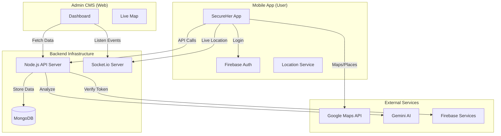

# SecureHer - System Architecture & Implementation Plan

## 1. Technology Stack
We will use a **MERN Stack + Firebase** hybrid approach for the best balance of speed, scalability, and features.

*   **Mobile App (Frontend)**: React Native (Expo)
    *   *Why*: Cross-platform (iOS/Android), fast development.
*   **Web Dashboard (CMS)**: Next.js (React)
    *   *Why*: Great for data visualization and admin panels.
*   **Backend API**: Node.js + Express
    *   *Why*: Fast, handles real-time data well, shares language (JS) with frontend.
*   **Database**: MongoDB
    *   *Why*: Flexible schema for storing complex data like incident reports and location logs.
*   **Authentication**: Firebase Auth
    *   *Why*: Easiest way to implement secure Gmail/Google Sign-In.
*   **Real-time Communication**: Socket.io
    *   *Why*: Critical for live SOS tracking on the CMS.

---

## 2. System Architecture

---

## 3. Key Workflows

### A. User Login (Firebase + MongoDB)
1.  User clicks "Sign in with Google" on Mobile App.
2.  Firebase handles the credential check and returns a **Token**.
3.  App sends this Token to your Backend API.
4.  Backend verifies the token with Firebase Admin SDK.
5.  **If New User**: Backend creates a user record in MongoDB.
6.  **If Existing**: Backend retrieves user profile.

### B. SOS Alert (Real-time)
1.  User presses SOS button.
2.  App captures current location.
3.  App emits a `socket` event: `sos_activated` with `{userId, location}`.
4.  **Backend**:
    *   Saves alert to MongoDB.
    *   Broadcasts alert to CMS via Socket.io.
    *   Triggers SMS/Notifications to trusted contacts (via Twilio/Expo).
5.  **CMS**: Instantly shows a flashing marker on the Admin Map.

---

## 4. Team Roles (4 Members)

To maximize efficiency, split the team by **functional layer**:

### 👨‍💻 Member 1: Backend Lead & DevOps
*   **Focus**: Server, Database, Real-time infrastructure.
*   **Tasks**:
    *   Setup Node.js/Express server.
    *   Design MongoDB Schemas (Users, Incidents, SOSLogs).
    *   Setup Socket.io for real-time updates.
    *   Deploy backend (e.g., Render/Heroku).

### 👨‍💻 Member 2: Mobile Core & Auth
*   **Focus**: App Foundation, User Management.
*   **Tasks**:
    *   Integrate Firebase Auth (Google Sign-In).
    *   Create User Profile screens & "Trusted Contacts" management.
    *   Handle local storage (AsyncStorage) for offline data.
    *   Manage App Navigation (Routes).

### 👨‍💻 Member 3: Mobile Safety Features
*   **Focus**: Maps, Sensors, AI.
*   **Tasks**:
    *   Implement **Journey Tracker** (Live location updates).
    *   Build **SOS Logic** (Shake detection, button press).
    *   Integrate Google Maps (Police/Hospital finder).
    *   Connect Gemini AI for the Chatbot.

### 👨‍💻 Member 4: CMS & Data Visualization
*   **Focus**: Web Dashboard, Admin Tools.
*   **Tasks**:
    *   Build Next.js Dashboard.
    *   Create "Live Map" to view active SOS alerts.
    *   Build "Incident Review" table (view reports, photos).
    *   Implement Analytics (charts showing safety trends).

---

## 5. Required APIs & Keys

You will need to generate and provide these keys:

### 1. Google Cloud Console (Critical)
*   **APIs to Enable**:
    *   Maps SDK for Android/iOS
    *   Maps JavaScript API (for CMS)
    *   Places API (finding police/hospitals)
    *   Directions API (navigation)
    *   Geocoding API (address to coords)
*   **Status**: *Need new valid API Key.*

### 2. Firebase Console
*   **Project**: Create a new project "SecureHer".
*   **Auth**: Enable "Google Sign-In".
*   **Files**: Download `google-services.json` (Android) and `GoogleService-Info.plist` (iOS).

### 3. Google Gemini AI
*   **API**: Gemini Pro / Flash.
*   **Status**: *Need new valid API Key.*

### 4. Database (MongoDB Atlas)
*   **Service**: Create a free cluster on MongoDB Atlas.
*   **Connection**: Get the `mongodb+srv://...` connection string.
